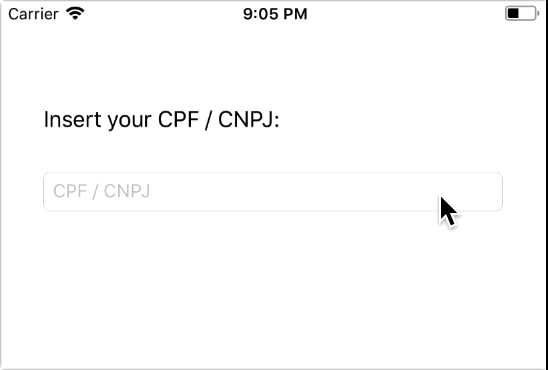

# CPF_CNPJ-Mask

Format your input text with a CPF / CNPJ mask. You can add a custom mask too.

## Preview




## Installation

### Manually

1. Download and drop InputTextMask.swift in your project.
2. Congratulations!


## Usage

### Getting Started

Clone this repository:

```sh
$ git clone https://github.com/falcaoaugustos/CPF_CNPJ-Mask.git
```

Open the **CPF_CNPJ-Mask.xcodeproj** file and build to see the example project.

### Example

Look at an example which editing a UITextField text attribute:

```swift
func textField(_ textField: UITextField, shouldChangeCharactersIn range: NSRange, replacementString string: String) -> Bool {
  if  textField.text.count == 14, string.count > 0 {
    return false
  }

  textField.text = string.count < 1 ?
    InputTextMask.applyMask(.CPF, toText: String(textField.text!.dropLast())) :
    InputTextMask.applyMask(.CPF, toText: textField.text! + string)

  return false
}
```

### Customization

You can add a new pattern updating the MaskType enum:

```swift
public enum MaskType: String {
  case CPF = "***.***.***-**"
  case CNPJ = "**.***.***/****-**"
  case birthday = "**/**/****"
}
```

## Contributing

Contributions are very welcome! If you'd like to contribute, feel free to send a pull request!

## License

CPF_CNPJ-Mask is released under an MIT license. See LICENSE file for more information.
